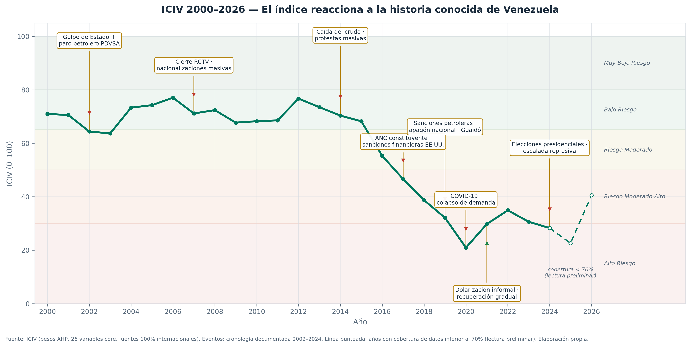

# ICIV - Indicador de Clima de Inversion Venezuela

[](https://github.com/Felipegomeze2/ICIV/actions/workflows/ci.yml)
[](https://github.com/Felipegomeze2/ICIV/actions/workflows/update_dashboard.yml)
[](https://felipegomeze2.github.io/ICIV/)



ICIV es un proyecto de analitica aplicada para leer el clima de inversion de
Venezuela sin depender de fuentes originadas en Venezuela. Separa tres piezas
con funciones distintas:

| Pieza | Frecuencia | Funcion |
|---|---|---|
| ICIV anual | 2000-2026 | Indice estructural defendible en seis dimensiones |
| ICIV Pulse | mensual desde 2010 | Monitor de señales de alta frecuencia entre publicaciones anuales |
| Laboratorio | interactivo | Simulador de sensibilidad del ICIV anual |

El entregable visual es [iciv_dashboard.html](./iciv_dashboard.html). La pagina
publica se actualiza con GitHub Actions los lunes cuando las fuentes mensuales
core pasan el control de vigencia.

## Criterio de datos

- Entran observaciones trazables a fuentes internacionales aprobadas.
- No entran datos del BCV, INE, PDVSA ni otras fuentes originadas en Venezuela.
- No se crean series sustitutas cuando una fuente no responde o no ha publicado.
- La cobertura se conserva como parte del resultado: un score con menor cobertura
  no debe presentarse con la misma fuerza que un score bien cubierto.
- Auditoria 2026-07-21: los archivos institucionales (WJP, Freedom House, HDI,
  PTS) se verificaron valor por valor contra las publicaciones oficiales y se
  regeneran desde ellas. Detalle en
  [docs/FUENTES_Y_VARIABLES.md](./docs/FUENTES_Y_VARIABLES.md).

## Diseno actual

El score anual usa 26 variables core. La reduccion evita variables con cobertura
debil, variables declaradas sin historia verificable y redundancia institucional.
La IED se excluye del score y se conserva como outcome economico externo para el
bloque exploratorio de validacion.

El Pulse usa 15 variables mensuales observadas de FRED, EIA International,
IMF IMTS (comercio espejo EEUU-Venezuela reportado por EEUU), World Bank
Pink Sheet (crudo Dubai), Guardian y GDELT. GDELT es opcional por estabilidad
de API: si falla, se registra la advertencia y no se fabrica una serie
sustituta. El componente SATV se alimenta solo de Pulse para que sus alertas
tengan una frecuencia coherente.

La prediccion visible es una sola trayectoria SARIMA de seis meses sobre Pulse,
con bandas de incertidumbre y backtesting rolling-origin contra naive, seasonal
naive y ETS. Los escenarios politicos optimista, base y pesimista no forman
parte de la vista publica principal.

La pestana de noticias combina Guardian en vivo con un snapshot de Google News
RSS filtrado por medios internacionales. Esa capa es contextual y no modifica
el score.

## Documentacion canonica

- [docs/MODEL_CARD.md](./docs/MODEL_CARD.md): ficha metodologica, alcance y limites.
- [docs/FUENTES_Y_VARIABLES.md](./docs/FUENTES_Y_VARIABLES.md): variables incluidas,
  variables apartadas, fuentes y politica de cobertura.
- [docs/GUIA_DECISIONES_ICIV.md](./docs/GUIA_DECISIONES_ICIV.md): plan de mejora y
  criterios para tomar decisiones antes de defensa o publicacion.
- [docs/DATASET_ICIV.md](./docs/DATASET_ICIV.md): estructura del dataset publico
  generado por el pipeline.
- [docs/BACKTESTING_FORECAST.md](./docs/BACKTESTING_FORECAST.md): evaluacion
  fuera de muestra del forecast Pulse.
- [iciv/data/sources/PROVENANCE.md](./iciv/data/sources/PROVENANCE.md): trazabilidad
  de artefactos de datos mantenida junto al pipeline.

## Repositorio

```text
ICIV/
|-- README.md
|-- docs/
|-- iciv_dashboard.html
|-- index.html
|-- .github/workflows/
`-- iciv/
    |-- main.py
    |-- scripts/
    |-- src/iciv/
    |-- tests/
    `-- data/
```

## Ejecucion local

```bash
cd iciv
pip install -e ".[dev]"
python main.py --no-fetch --no-open
```

`main.py` regenera el dashboard y los artefactos procesados. El control semanal
de fuentes Pulse puede ejecutarse aparte:

```bash
python scripts/check_pulse_inputs.py
```

Tambien genera `iciv/data/processed/iciv_dataset_wide.csv` y
`iciv/data/processed/iciv_dataset_largo.csv` para auditoria, backtesting y
replicacion. Adicionalmente crea el paquete auditable:

```text
iciv/data/releases/latest/
```

Ese paquete incluye diccionario, cobertura anual, provenance por fuente,
manifest con hashes y copias de los CSV publicos.

## Modulos que importan en defensa

1. El ICIV anual responde la pregunta estructural: como cambia el clima de
   inversion cuando se combinan macro, energia, institucionalidad, apertura,
   capital humano y percepcion internacional.
2. Pulse responde la pregunta operativa: que senales mensuales disponibles se
   estan moviendo antes de que lleguen las fuentes anuales.
3. SATV no es un segundo indice: traduce el Pulse en alertas de cobertura,
   nivel y tendencia reciente.
4. El mapa satelital no es decoracion: muestra la evidencia subnacional de
   actividad nocturna que complementa la dimension energetica y la historia.

## Nota de interpretacion

ICIV es un indicador compuesto para analisis y comparacion temporal. No sustituye
due diligence sectorial, analisis legal de sanciones ni una decision financiera
particular.
