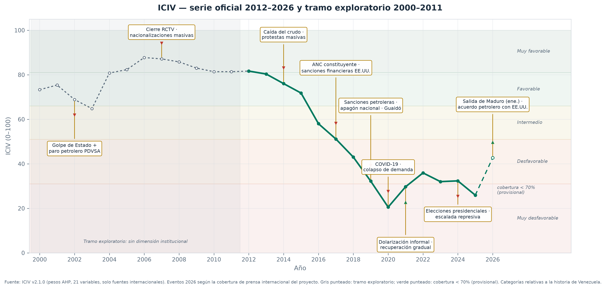

# ICIV · Indicador de Clima de Inversión de Venezuela

Proyecto de grado de Felipe Gómez Espinal, Especialización en Big Data e Inteligencia de Negocios, Universidad EIA.

[](https://github.com/Felipegomeze2/ICIV/actions/workflows/ci.yml)
[](https://github.com/Felipegomeze2/ICIV/actions/workflows/update_dashboard.yml)

**Dashboard público:** https://felipegomeze2.github.io/ICIV/

ICIV es un indicador compuesto **descriptivo** del entorno de inversión venezolano. Combina un índice anual de seis dimensiones (21 variables, pesos AHP) con una señal mensual (Pulse, 15 variables), un semáforo de alertas (SATV), controles de cobertura y validación retrospectiva. La escala compara períodos de Venezuela consigo misma; no estima rentabilidad ni probabilidad de riesgo país, y no compara países.



## Principios de datos

- **Solo fuentes internacionales.** Ningún organismo venezolano (BCV, INE, PDVSA) se usa como fuente.
- **Ningún dato inventado ni falso.** Sin interpolación, sin arrastre de valores y sin sustituir proveedores. Un faltante queda como faltante y la cobertura lo muestra.
- **Valores imposibles del proveedor se excluyen y se registran**; nunca se reemplazan.
- **La identidad de cada serie se verifica** contra el título que publica su proveedor.

## Versión metodológica 2.1

- Serie oficial 2012–2026 (las seis dimensiones); 2000–2011 como tramo extendido exploratorio.
- Universo fijo de 21 variables; cobertura calculada con los pesos realmente utilizados; piso de 50% por dimensión.
- AHP entre dimensiones (CR = 0,0081) y benchmark de pesos iguales; 79 escenarios de robustez.
- Pulse con normalización expansiva causal y bloque de comercio con importaciones de EE.UU. desde Venezuela (EIA).
- Pronóstico mensual de persistencia, comparado con SARIMA y naive estacional sobre los mismos pares.
- Validación externa por tramo, en niveles y diferencias, con HAC y Holm.
- Luminosidad satelital fuera del índice; el mapa estatal es contexto.
- Releases con snapshots, manifiesto y hashes SHA-256.

## Reproducción

Python 3.11 o posterior. Desde la raíz:

```sh
python -m pip install -e "iciv/[dev]"
python -m pytest iciv/tests -q
node --test iciv/tests/simulator.test.cjs
python iciv/main.py --no-fetch --no-open
python iciv/scripts/verify_release.py
```

- `--no-fetch` reproduce los CSV archivados; no los actualiza. Sin esa opción, el pipeline intenta descargar todas las fuentes. Las credenciales (EIA, Guardian, etc.) van en variables de entorno o en `iciv/.env`, nunca en el repositorio.
- `--no-package` regenera el trabajo sin modificar `releases/latest`.
- `--release-id nombre` congela una entrega inmutable. Las releases nombradas existentes no se sobrescriben.

El dashboard se genera en `iciv_dashboard.html`; la validación en `iciv/data/processed/iciv_validacion.html`; los resultados vigentes en [docs/RESULTADOS_ACTUALES.md](docs/RESULTADOS_ACTUALES.md).

## Documentación

- [Metodología](docs/METODOLOGIA.md)
- [Fuentes y semántica](docs/FUENTES_Y_VARIABLES.md)
- [Resultados actuales](docs/RESULTADOS_ACTUALES.md) (generado por el pipeline)
- [Dataset y reproducción](docs/DATASET_ICIV.md)
- [Validación externa](docs/VALIDACION_EXTERNA.md)
- [Pronóstico y backtesting](docs/BACKTESTING_FORECAST.md)
- [Robustez ampliada](docs/ROBUSTEZ_AMPLIADA.md) (generado por el pipeline)
- [Ficha del modelo](docs/MODEL_CARD.md)
- [Auditoría de fuentes](docs/AUDITORIA_FUENTES_ACTUAL.md)
- [Decisión satelital](docs/REVISION_SATELITAL.md)
- [Registro de decisiones](docs/VALIDACION_PENDIENTE.md)
- [Cierre y pendientes](docs/CIERRE_PROYECTO.md)
- [Bibliografía](docs/BIBLIOGRAFIA.md)
- [Borrador de tesis](docs/tesis/BORRADOR_TESIS.md)
- Incidentes: [series de comercio del Pulse](docs/INCIDENTE_SERIES_COMERCIO.md), [ejecución 38](docs/INCIDENTE_ACTIONS_38.md)

Las presentaciones de avances anteriores son históricas. Sus cifras no sustituyen la metodología 2.1 ni los resultados de la release vigente.
